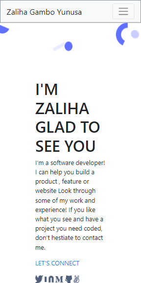

# portfolio

> portfolio set up and mobile version is a second project i am working on in my first week of starting at microverse

mobile set up.
home 
logo
contact
icons

## Built With

- Html/css

## Live Demo

[Live Demo Link](https://xaleehrtyunus.github.io/portfolio/)

## Getting Started
- open the command line
- type "git clone https://github.com/xaleehrtyunus/portfolio.git"
or 
- navigate to code tab 
- select index.html 
enjoy

👤 **Zaliha Zambo Yunusa**

- GitHub: [@githubhandle](https://github.com/xaleehrtyunus)
- Twitter: [@twitterhangle](https://twiiter.com/yunusxaleehrt)
- LinkedIn: [@linkedin](https://linkedin.com/zalihagamboyunusa)

